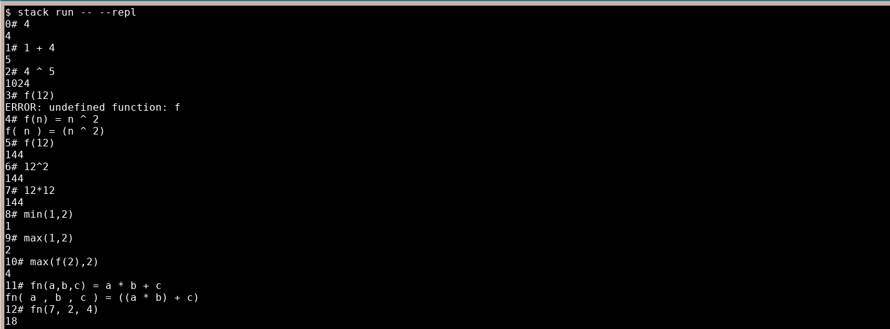
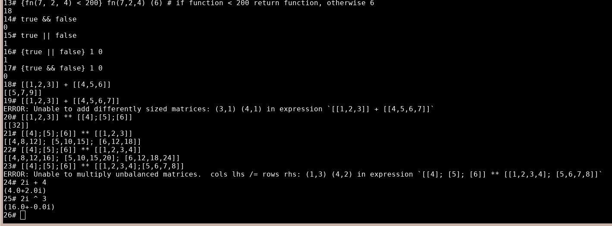

# computor

Turing complete calculator built in haskell using a small [parser combinator](https://en.wikipedia.org/wiki/Parser_combinator) library

## Usage

```
stack build
stack run -- --help                         # help
stack run -- --poly "3X + 2X^2 = 4"         # solve polynomial
stack run -- --poly "X^2 + 2X + 2 = 0"
stack run -- --repl --help                  # help
stack run -- --repl --nopreset              # skip loading preset function/var definitions
stack run -- --repl example/example1.txt    # load specified file
```

| Data types |                                                         |
|------------|---------------------------------------------------------|
| Int        | `5` `-20`                                               |
| Float      | `3.5`                                                   |
| Complex    | `6.2i` `1i` `-3i`                                       |
| Matrix     | `[[1, 2]; [3, 4]]` `[[1.3, 2i]; [3 + 2i, -4.3 - 2.2i]]` |

| Commands/Operators                        |                                      |
|-------------------------------------------|--------------------------------------|
| @help                                     | help msg                             |
| @quit                                     | quit                                 |
| @dump                                     | show all defined variables/functions |
| @reset                                    | clear all definitions                |
| @poly                                     | evaluate polynomial                  |
| `1 ^ 2` `3i ^ 2`                          | exponent                             |
| `[[1,2]] ** [[3];[4]]`                    | matrix multiplication                |
| `9 * 4`                                   | multiplication                       |
| `8 / 2.8`                                 | division                             |
| `11 % 6`                                  | mod (integers only)                  |
| `4.2i + 2`                                | addition                             |
| `5 - 2`                                   | subtraction                          |
| `4 < 5`                                   | lt                                   |
| `5 > 4`                                   | gt                                   |
| `2 == 2`                                  | eq                                   |
| `1 <= 8`                                  | leq                                  |
| `8 >= 3`                                  | geq                                  |
| `0 \|\| 1`                                | or                                   |
| `1 && 1`                                  | and                                  |
| `a = 42`                                  | assignment                           |
| `f(a) = a * 2` `f(a,b,c) = a+b+c`         | function definition                  |
| `{1==1} (1) (0)` `min(a,b) = {a < b} a b` | conditional                          |

## Dependencies

- readline (readline-devel)

## Tools

- [Parsing.hs](https://www.youtube.com/watch?v=dDtZLm7HIJs) - Functional parser combinator library from chapter 13 of Programming in Haskell,
- [hlint](https://hackage.haskell.org/package/hlint) - powerful linter `hlint src/ app/`
- [brittany](https://hackage.haskell.org/package/brittany) - code formatter
- [stack](https://docs.haskellstack.org/en/stable/README/) - project manager




